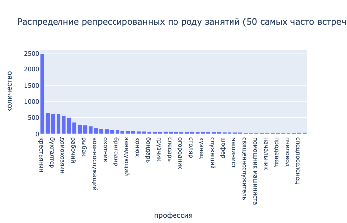

# Хабаровская книга памяти WIP
## Нормализация данных

В данном репозитории содержатся файлы, касающиеся нормализации данных Хабаровской книги памяти жертв политических репрессий. 

В папке data содержится файл с исходными данными, обработанными и экспортированными для дальнейшей нормализации из базы [Открытого Списка](https://ru.openlist.wiki) - [mb_khabarovsk.csv](data/mb_khabarovsk.csv).

Общий размер книги памяти - **29 581** записей. 

К настоящему моменту обработано и нормализованы следующие поля:

### Гражданство (29 581 / 29 581)

Файл с нормализованными данными		[citizenship.csv](data/citizenship.csv)

Файл с программой обработки					[citizenship.ipynb](citizenship.ipynb)

### Национальность (29 581 / 29 581)

Файл с нормализованными данными		[nationality.csv](data/nationality.csv)

Файл с программой обработки					[nationality.ipynb](nationality.ipynb)

### Пол (29 581 / 29 581)

Файл с нормализованными данными		[gender.csv](data/gender.csv)

Файл с программой обработки					[gender.ipynb](gender.ipynb)

### Социальное происхождение (29 581 / 29 581)

Файл с нормализованными данными		[social_background.csv](data/social_background.csv)

Файл с программой обработки					[social_background.ipynb](social_background.ipynb)

### Образование (29 581 / 29 581)

Файл с нормализованными данными		[education.csv](data/education.csv)

Файл с программой обработки					[education.ipynb](education.ipynb)

### Партийная принадлежность (29 581 / 29 581)

Файл с нормализованными данными		[party.csv](data/party.csv)

Файл с программой обработки					[party.ipynb](party.ipynb)

### ФИО и варианты ФИО (29 581 / 29 581)

Файл с нормализованными данными		[names.csv](data/names.csv)

Файл с программой обработки					[names.ipynb](names.ipynb)

### Род занятий (15 227 / 29 581)

Файл с нормализованными данными		WIP

Файл с программой обработки					[Profession.ipynb](profession.ipynb)

## TO-DO на апрель:
- [ ] Нормализация оставшихся 14 354 строк в поле "Род занятий"
- [ ] Нормализация 29 581 строк в поле "Дата рождения"
- [ ] Нормализация 29 581 строк в поле "Дата смерти"
- [ ] Нормализация 29 581 строк в поле "Дата расстрела"
- [ ] Нормализация 2 000 строк в поле "Место рождения"